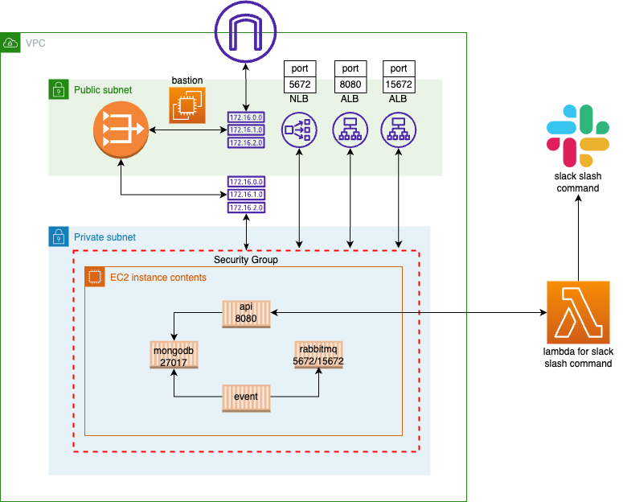

# evaluation infrastructure as Code with terraform



## 환경 설정

### 1. aws cli 설치

최신 버전의 aws cli를 운영체제에 맞는 방법으로 설치합니다.

<https://docs.aws.amazon.com/ko_kr/cli/latest/userguide/getting-started-install.html>

aws configure를 설정하여 access key와 secret access key를 등록합니다.

```shell
aws configure
```

### 2. terraform 설치

최신 버전의 terraform을 운영체제에 맞는 방법으로 설치합니다.

<https://developer.hashicorp.com/terraform/tutorials/aws-get-started/install-cli>

### 3. git clone

최신 버전의 git을 운영체제에 맞는 방법으로 설치합니다.

<https://git-scm.com/downloads>

다음 명령어로 이 Repository를 clone 합니다.

```shell
git clone https://github.com/mspt2/msp-t3-dev-evaluation-deploy.git
```

### 4. python 설치

python3 버전을 운영체제에 맞는 방법으로 설치합니다.

<https://www.python.org/downloads/>

### 5. route53 도메인 발급 및 Certificate Manager 인증서 발급

Route53 도메인 발급

<https://github.com/mspt2/Operation_gitops_2023/blob/main/docs/1-5-Route53.md>

Certificate Manager 인증서 발급

<https://github.com/mspt2/Operation_gitops_2023/blob/main/docs/4-1-ACM.md>

발급받은 인증서의 arn은 복사하여 terraform.tfvars에 활용하도록 합니다.


## terraform apply

clone한 repository의 경로에서 `provider.tf`를 수정합니다.

`terraform.tfstate` 파일이 저장될 s3 bucket은 사전에 준비합니다.

준비되지 않았다면 backend 블럭을 모두 `#` 기호로 주석처리 합니다.

```terraform
terraform {
  backend "s3" {
    bucket  = "state file이 저장될 s3 bucket명"
    key     = "evaluation/terraform.tfstate"
    region  = "버킷의 위치"
    encrypt = true
  }
  required_version = ">=1.1.3"
}
provider "aws" {
  region = var.aws_region
}

```

`terraform.tfvars` 파일에 적절한 값으로 수정합니다.

```terraform
aws_region            = "자원이 생성될 리전"             # "ap-northeast-1"
my_ami                = "docker 인스턴스의 ami(ubuntu 22.04 free tier)" # "ami-088da9557aae42f39"
cidr_blocks_to_access = ["global lounge CIDR", ...]
start_date            = "실습참여도 과제 시작 시점" # LocalDateTime format 2023-01-01T00:00:00
end_date              = "실습참여도 과제 종료 시점" # LocalDateTime format 2023-01-01T00:00:00
acm_arn               = "ACM 인증서 ARN"
```

다음 명령어로 terraform project를 초기화합니다.

```shell
terraform init
```

다음 명령어로 terraform 코드가 유효한지 확인합니다.

```shell
terraform validate
```

다음 명령어로 생성될 자원을 확인합니다.

slack_token 변수에는 slack bot user token, 또는 null 값을 포함한 아무 값이나 입력합니다.

```shell
terraform plan
```

오류와 특별한 이상이 없다면 다음 명령어로 자원을 생성합니다.

slack_token 변수에는 slack bot user token을 입력합니다.

```shell
terraform apply --auto-approve
```

<br>

terraform output으로 확인할 수 있는 값은 다음과 같습니다.

(예시)

```shell
lb_dns = "evaluation-lb-18e0b053fdf0dd5e.elb.us-east-1.amazonaws.com"
```

lb_dns는 amqp에 접근할 수 있는 NLB의 DNS입니다.

수강생들에게 RABBITMQ_HOST로 이 주소, 또는 route53, bit.ly 등으로 쉽게 만들어진 url을 제공할 수 있습니다.

(예시)

```shell
lambda_url = "https://bta7emob6ajegjiojc7s6kv5nm0flrxy.lambda-url.us-east-1.on.aws/"
```

lambda_url은 slack app의 slash command에서 사용될 https url입니다.

slack app을 만드는 방법에 대해서는 다음 주소에서 확인합니다.

<https://tall-fuel-e5e.notion.site/4-Slack-bot-fedf51dd032f4fe895d73443847115fc>

slack app의 slash command를 생성할 때 request url로 이 주소를 사용합니다.

slack의 slash command를 보내면, lambda로 넘어가서 결과를 알려줍니다.

lambda의 소스 코드는 `lambda/index.mjs`와 동일합니다.

(예시)

```shell
mongodb_password = <sensitive>
```

mongodb의 패스워드입니다. `terraform output mongodb_password` 명령어로 확인 가능합니다.

(예시)

```shell
rabbitmq_password = <sensitive>
```

rabbitmq의 패스워드입니다. `terraform output rabbitmq_password` 명령어로 확인 가능합니다.

rabbitmq의 계정명은 admin입니다.

<br>

다음 명령어로 자원을 종료합니다.

slack_token 변수에는 slack bot user token, 또는 null 값을 포함한 아무 값이나 입력합니다.

```shell
terraform destroy --auto-approve
```

## api, rabbitmq-management route53에 연결하기

api와 rabbitmq-management는 application loadbalancer를 통해 HTTPS로 접속할 수 있습니다.

이를 위해 route53에서 api와 rabbitmq-management에 대한 record를 등록하도록 합니다.

우선 hosted zone에서 Create record를 클릭합니다.


api 레코드를 아래와 같이 api loadbalancer를 등록하여 입력합니다.


rabbitmq-management 레코드를 아래와 같이 management loadbalancer를 등록하여 입력합니다.


### stack 확인하기

AWS cloudwatch log group 중 `msp-t3-dev-evaluation` 로그 그룹에서도 컨테이너의 로그를 확인할 수 있고

`/aws/lambda/slack_lambda` 로그 그룹에서 lambda의 로그를 확인할 수 있습니다.

직접 인스턴스에 접속해서도 확인 가능합니다.

AWS console > EC2 > instances > evaluation-docker-server에서

connect 버튼을 클릭한 후 Session Manager 탭에서 connect 버튼을 클릭하면 인스턴스에 연결할 수 있습니다.

다음 명령어로 stack에 올라온 서비스들을 확인할 수 있습니다.

```shell
sudo docker stack services mspt3
```

다음 명령어로 전체 container의 정보를 확인할 수 있습니다.

```shell
sudo docker ps
```

다음 명령어로 서비스의 log를 확인할 수 있습니다.

```shell
sudo docker service logs <<service_name>>
```

## AWS 보안 설정

1. Security group 생성 (1개당 60개 rule 입력 가능)

2. 위에서 생성 한 Security group ID에 대해 수집 된 수강생 VM IP목록으로 다음의 JSON파일 작성(최대 60개)

   ```json
    {
        "GroupId": "sg-037c0b4976b41baf2",
        "IpPermissions": [
            {
                "IpProtocol": "tcp",
                "FromPort": 5672,
                "ToPort": 5672,
                "IpRanges": [
                    {"CidrIp": "121.133.133.0/24"},
                    {"CidrIp": "221.167.219.0/24"}
                ]
            }
        ]
    }
   ```

3. AWS CLI에서 다음의 명령어 수행

```shell
aws ec2 authorize-security-group-ingress --cli-input-json file://./windows-vm-sg.json
```

## mongoDB compass 접속

mongoDB compass는 mongodb에 접속하는 것을 도와주는 도구입니다.

접속을 위해서 우선 mongDB compass를 다운로드합니다.

<https://www.mongodb.com/try/download/compass>


<br>

vscode의 원격 접속을 이용하여 bastion 서버를 매개로 하여 포트 포워딩을 하도록 합니다.

Windows에서의 openSSH 설치에 대해서는 다음 문서를 참고합니다.

<https://learn.microsoft.com/ko-kr/windows-server/administration/openssh/openssh_install_firstuse?tabs=gui>

vscode의 remote extensions에 대해서는 다음 문서를 참고합니다.

<https://code.visualstudio.com/docs/remote/ssh>

<br>

ssh config를 다음과 같이 작성합니다.

windows의 경우 기본적으로 `%userprofile%\.ssh\config` 파일에 작성합니다.


```config
Host docker-server
    ProxyJump ubuntu@proxy
    HostName 10.0.10.10
    Port 22
    User ubuntu
    IdentityFile <<docker-instance-key.pem 위치>>
  
Host proxy
    HostName <<bastion_server_public_ip>>
    User ubuntu
    Port 22
    IdentityFile <<docker-instance-key.pem 위치>>
```

<br>

vscode의 remote explorer에서 docker-server를 클릭하여 접속합니다.


<br>

원격 접속한 세션에서 메뉴 > 터미널 > New Terminal을 클릭하여 터미널 섹션을 활성화합니다.

터미널 섹션에서 PORTS 탭에서 Add Port를 클릭한 수 27017 포트를 입력하여 포트 포워딩을 합니다.


<br>

mongoDB compass에서 다음 정보로 연결을 합니다.

| 항목 | 값 |
| --- | - |
|Username|eval|
|Password|`terraform output mongodb_password` 명령어의 결과|
|Authentication Database|students|


students 데이터베이스의 message_data를 클릭하면 쿼리를 할 수 있습니다.

